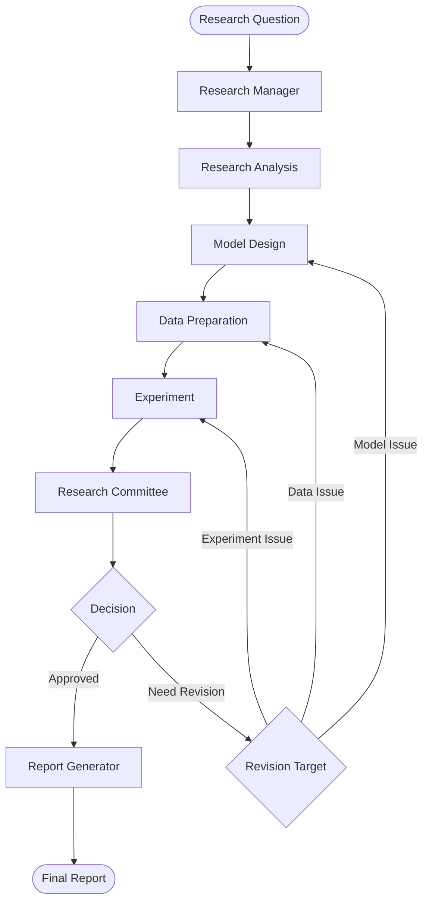

# QuantResearchAgent

面向券商研究、上市公司研究与管理咨询场景的多智能体金融研究平台。项目以 LangGraph 编排研究流程，以 Pydantic 约束 Agent 输出，并将数据、模型、证据、评审和报告连接为可追溯闭环。

> v0.1.0 release candidate · Python 3.11 · offline-first · not investment advice

## 项目亮点

- **研究闭环**：Research Manager、Research Analysis、Model Design、Data Preparation、Experiment、Review、Report 七个节点由 Graph 调度，Node 之间不直接调用。
- **双 Router 与修改循环**：委员会决定是否通过；若需修改，再按模型、数据或实验问题返回对应节点，并由 `max_revisions` 防止无限循环。
- **研究与咨询双路线**：支持量化研究、上市公司研究、行业研究、市场策略、事件研究和公司咨询的统一输入与路由。
- **真实研究工具**：已实现 OLS、Fama–MacBeth、Portfolio Sort、稳健标准误、显著性检验、稳健性检查和实验审计 artifact。
- **公开数据证据链**：BaoStock 提供免 Key 行情与财务指标；CNInfo 提供法定披露元数据和 PDF；年报按页抽取并生成稳定证据 ID。
- **受约束的 LLM**：默认支持 DeepSeek，同时保留 Gemini、OpenAI 与 Fake LLM；研究结论只能引用已提供证据，路由和统计数字由代码控制。
- **专业交付**：可生成 Markdown 研究报告和 Word 公司深度研究报告，包含核心观点、风险矩阵、相对估值、Owner、Timeline、KPI 与证据附录。
- **工程质量**：211 项离线测试、Ruff、mypy、分支覆盖率门槛、依赖锁定、依赖漏洞审计、密钥审计和 GitHub Actions CI。

## 工作流



公司研究与咨询任务位于同一平台路由层，并复用证据、分析产物、Debate Gate、委员会评审和报告模板。详细设计见 [平台架构](docs/platform_architecture.md)、[研究委员会](docs/research_committee.md) 与 [报告规则](docs/reporting.md)。

## 快速开始

### Windows PowerShell

```powershell
py -3.11 -m venv .venv
.\.venv\Scripts\python.exe -m pip install pip==25.3
.\.venv\Scripts\python.exe -m pip install -r requirements-dev.lock
.\.venv\Scripts\python.exe -m pytest -q
.\.venv\Scripts\python.exe main.py
```

无需激活虚拟环境。`main.py` 默认只编译 Graph，不访问网络，也不会调用付费模型。

### Linux / macOS

```bash
python3.11 -m venv .venv
.venv/bin/python -m pip install pip==25.3
.venv/bin/python -m pip install -r requirements-dev.lock
.venv/bin/python -m pytest -q
.venv/bin/python main.py
```

## 不需要 API Key 的 Demo

所有离线 Demo 都使用合成 fixture 或内置结构化产物，不调用 LLM API。

```powershell
# 7 Node IVOL 研究闭环，包含一次修改路由
.\.venv\Scripts\python.exe -m examples.ivol_research_demo

# 上市公司研究：BYD 离线证据 fixture → 委员会 → 报告
.\.venv\Scripts\python.exe -m examples.company_research_demo

# 六类研究与咨询服务线的路由演示
.\.venv\Scripts\python.exe -m examples.platform_routing_demo

# 风险咨询 + Debate Gate
.\.venv\Scripts\python.exe -m examples.byd_risk_advisory_demo
```

示例报告见 [reports/example_report.md](reports/example_report.md)。该文件明确标记为离线合成 fixture，不包含真实投资结论。

## 免费公开数据 Demo

BaoStock 无需 API Key。下面的命令会访问公开网络并缓存数据，但不会调用 LLM：

```powershell
.\.venv\Scripts\python.exe -m examples.baostock_ivol_data_demo `
  --codes sz.000001,sh.600000,sz.000858,sh.600519,sz.000333 `
  --start 2023-01-01 `
  --end 2025-12-31
```

数据截止日、缓存、点时匹配和研究限制见 [BaoStock 数据说明](docs/baostock_data.md)。Tushare Pro 保留为可选适配器，不是默认依赖的数据入口。

## 真实 LLM 配置

复制配置模板，不要把密钥写入代码或提交到 Git：

```powershell
Copy-Item .env.example .env
```

仅在本地 `.env` 填写所选 Provider 的密钥：

```dotenv
LLM_PROVIDER=deepseek
DEEPSEEK_API_KEY=your-api-key
DEEPSEEK_MODEL=deepseek-v4-flash
```

先运行一次低成本连接检查：

```powershell
.\.venv\Scripts\python.exe -m examples.llm_connection_demo
```

只有显式加入 `--live` 才会产生模型调用：

```powershell
.\.venv\Scripts\python.exe main.py `
  --live `
  --question "研究A股市场中IVOL是否负向预测未来收益" `
  --data examples\data\ivol_fixture.csv `
  --universe "Synthetic IVOL workflow fixture" `
  --survivorship-policy "Fixture contains its complete declared universe" `
  --max-revisions 1 `
  --report reports\ivol_live_report.md
```

生产组装层将同一 Provider 注入需要语言推理的节点。Data Preparation、Experiment、Router 和最终统计报告保持确定性，不让 LLM 重算数据或决定路由。

## 公司研究：公开披露到专业报告

公司研究路线已经跑通以下链路：

1. 使用 BaoStock 获取截止日内行情、估值倍数和按发布日期筛选的财务指标；
2. 使用 CNInfo 获取法定披露和完整年报 PDF；
3. 校验 PDF 类型、大小与 SHA-256，并缓存逐页文本；
4. 定位业务模式、管理层讨论、分部、现金流和风险页面；
5. DeepSeek 只能基于页级证据生成研究解释；
6. 代码完成相对估值、同业比较、证据校验和委员会评审；
7. 输出 Markdown、结构化 JSON artifact 和专业 Word 报告。

真实公司 Demo 会访问网络并调用所配置的 LLM：

```powershell
.\.venv\Scripts\python.exe -m examples.company_research_filing_demo `
  --as-of-date 2026-08-08
```

运行时报告、下载的 PDF、API 配置与市场数据均被 Git 忽略。仓库只发布代码、合成 fixture、说明文档和明确批准的离线示例。

## IVOL 研究与论文复现

IVOL 是平台的量化研究 Demo，而不是产品边界。项目包含：

- 下一自然月收益对齐和前视偏差检查；
- 免费 BaoStock 收益与日频 IVOL 抽样复核；
- 风险自由利率和历史行业点时匹配；
- 本地 Fama–French 五因子严格摄入；
- Fama–MacBeth、交互项、秩稳健性和顺序 5×5 组合排序。

完整方法、数据许可边界和复现实验见 [论文复现说明](docs/thesis_replication.md) 与 [全市场五因子组合说明](docs/full_universe_ff5_portfolio.md)。持牌 CSMAR 文件及派生研究面板位于 `data/`，不得提交。

## 项目结构

```text
QuantResearchAgent/
├── agents/             # Agent 角色与 Node 实现
├── analysis_engines/   # 公司、行业、估值等可注册分析引擎
├── data_sources/       # BaoStock、CNInfo、Tushare、CSV/Parquet 适配器
├── graph/              # LangGraph 拓扑、Router、Debate 与平台调度
├── literature/         # 核心期刊白名单与 Crossref 检索
├── llm/                # Structured LLM、Fake LLM 与 Provider 工厂
├── schemas/            # Pydantic Schema 与 ResearchState
├── tools/              # 统计、回测、评审和报告工具
├── examples/           # 离线和真实数据 Demo
├── tests/              # 自动化测试
├── docs/               # 架构、数据与研究边界
├── scripts/            # 发布审计与研究流水线
└── reports/            # 运行时输出；仅批准的离线示例进入 Git
```

## 可信边界

- 本项目是研究工程原型，不是交易系统、投顾系统、审计工具或监管合规意见。
- LLM 的任务是组织和解释已提供证据；统计数字、数据指纹、截止日、路由和批准状态由代码校验。
- `verified` finding 必须引用已登记的 EvidenceRecord；解释性判断明确标记为 inferred。
- 免费数据不能自动消除幸存者偏差、行业口径差异、复权误差或持牌数据缺口。
- 相对估值不是目标价模型；公司研究结论必须由人工分析师复核。
- Portfolio Sort 已实现；通用 Backtest 仍属于后续版本范围。

## 开发质量门

```powershell
.\.venv\Scripts\python.exe -m ruff check .
.\.venv\Scripts\python.exe -m ruff format --check .
.\.venv\Scripts\python.exe -m mypy agents data_sources graph literature llm schemas tools examples production.py config.py logging_config.py main.py
.\.venv\Scripts\python.exe -m pytest --cov --cov-report=term-missing
.\.venv\Scripts\python.exe scripts\release_audit.py
$env:PYTHONUTF8='1'
.\.venv\Scripts\python.exe -m pip_audit -r requirements.lock
```

GitHub Actions 会在 push 与 pull request 时执行同一套检查。`release_audit.py` 会阻止 `.env`、疑似密钥、未批准的二进制数据和运行时报告进入发布候选文件。

## 发布与贡献

- 当前目标版本：[v0.1.0](CHANGELOG.md)
- 开发路线：[ROADMAP.md](ROADMAP.md)
- 贡献约定：[CONTRIBUTING.md](CONTRIBUTING.md)
- 安全边界：[SECURITY.md](SECURITY.md)
- License：[MIT](LICENSE)
