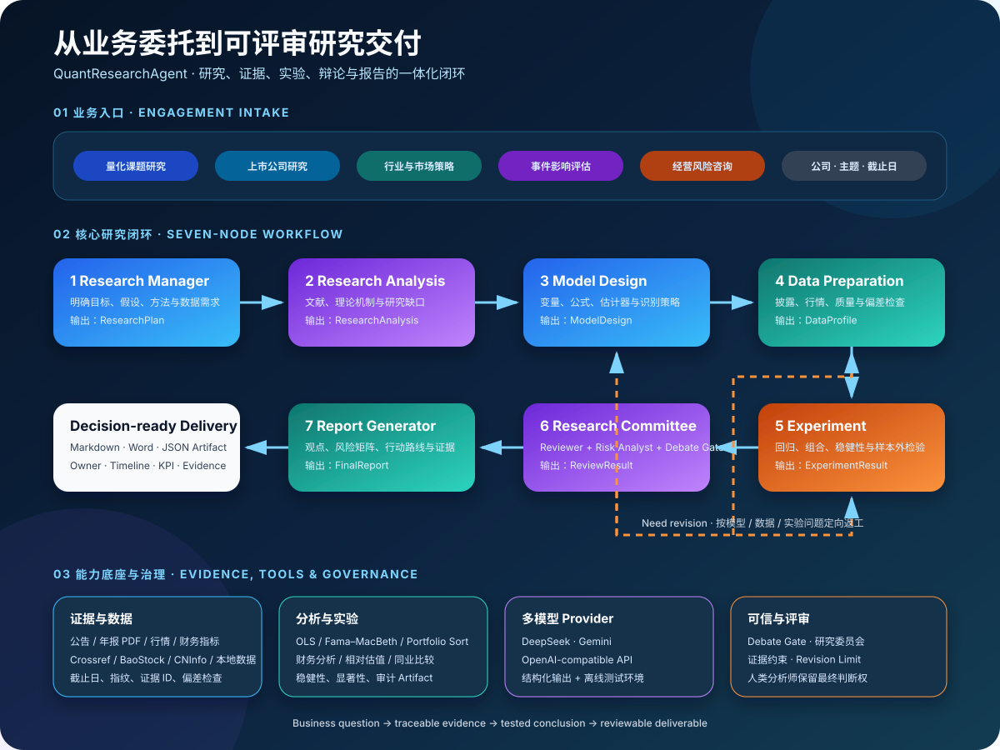
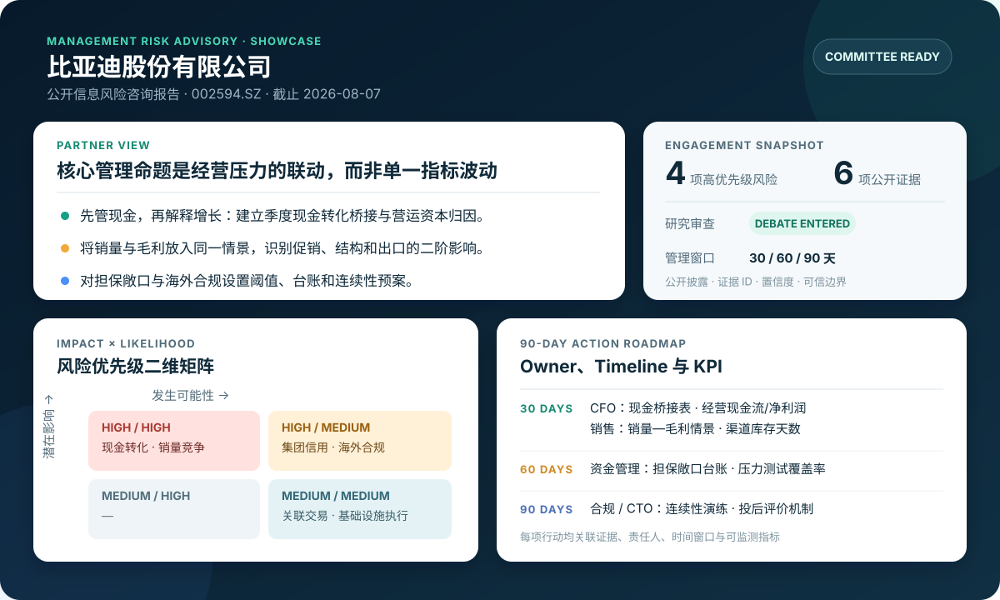

# QuantResearchAgent

**面向证券研究与管理咨询的可追溯多智能体研究平台。**

[](https://github.com/210122evanlu-arch/QuantResearchAgent/actions/workflows/ci.yml)
[](https://github.com/210122evanlu-arch/QuantResearchAgent/releases)


平台围绕研究规划、证据检索、金融建模、实证分析、委员会评审和报告生成构建端到端工作流。项目关注的核心问题，是如何将大语言模型纳入可验证、可复现、可审计的研究流程，而非扩展通用对话能力。

模型接入层支持 DeepSeek、Gemini 及 OpenAI 兼容接口，并提供无需 API Key 的离线测试环境。统计计算、数据指纹、条件路由和审批状态由确定性代码控制；语言模型负责研究任务拆解、证据解释与观点组织。

## 快速评估

- 业务与技术全景：[项目速览](docs/portfolio_brief.md)
- 面试现场运行：[五分钟演示指南](docs/demo_guide.md)
- 已实现与规划边界：[能力成熟度说明](docs/capability_status.md)
- 当前版本变化：[v0.2.0 Release Notes](docs/releases/v0.2.0.md)

## 业务范围

| 服务线 | 典型课题 | 核心产出 |
| --- | --- | --- |
| 量化研究 | “投资者情绪是否预测未来收益？” | 研究计划、文献与理论、模型设计、回归/组合实验、稳健性结果、评审报告 |
| 上市公司研究 | “这家公司的增长质量、竞争力和估值如何？” | 财务质量、业务诊断、同业比较、相对估值、风险与证据附录 |
| 经营风险咨询 | “哪些风险应进入管理层未来 90 天议程？” | 风险优先级矩阵、财务异常预警、关键争议、Owner、Timeline 与 KPI |
| 行业研究 | “高端白酒上市公司呈现怎样的经营分化？” | 产业链、需求与竞争格局、同业对照、情景矩阵、监测指标 |
| 市场策略 | “市场环境变化会影响哪些公司和指标？” | 驱动因素、情景假设、监测指标、影响路径与研究结论 |
| 事件研究 | “政策或公司事件带来了什么短中期影响？” | 事件窗口、市场模型、AR/CAR、显著性、污染检查与局限性 |

标准化任务输入覆盖研究对象、证券代码、研究主题、评估截止日、数据范围、辩论开关与交付类型。Intent Router 据此分发至对应服务线，并将研究产物汇总为统一 Schema 下的可审计交付物。

六条服务线均已具备标准化输入、专属执行工作流、委员会评审和端到端案例。离线案例用于稳定验证业务链路，并不代表所有真实数据源和生产部署能力已经完成；完整边界见[能力成熟度说明](docs/capability_status.md)。

## 研究与咨询工作流

<p align="center">
  
</p>

七个核心 Node 各自读取 `ResearchState` 并返回结构化增量，节点之间不直接调用。Research Committee 对研究结论作出批准或修订决定；Revision Router 根据问题类型返回模型、数据或实验节点，修改次数上限用于保证流程可终止。

公司研究与咨询任务复用证据管理、分析引擎、Debate Gate、委员会评审和报告生成能力。研究质量要求在系统中映射为以下可执行约束：

| 研究质量要求 | 系统机制 |
| --- | --- |
| 结论可追溯 | EvidenceRecord、页级证据 ID、文档哈希与评估截止日 |
| 数值可复现 | Data Preparation 与 Experiment 由确定性代码执行 |
| 重大判断接受对抗审查 | Debate Gate 根据复杂度与风险决定是否进入辩论 |
| 研究缺陷闭环修订 | Decision Router 与 Revision Router 返回对应问题节点 |
| 评审流程可终止 | Moderator、`max_debate_rounds` 与 `max_revisions` 约束循环次数 |
| 建议具备可执行性 | 报告输出风险矩阵、Owner、Timeline、KPI 与证据附录 |
| 交付经过独立质量复核 | IQR 重算指标并校验截止日、证据、哈希、报告一致性与保证边界 |
| 自动审批不冒充人工签字 | IQR 通过后仍需 Human Sign-off，未签署报告保持讨论稿状态 |

## 案例：上市公司经营风险咨询

**案例设定**

> 基于截止日内公开信息，评估比亚迪的经营、财务、治理与外部风险。识别管理层应优先处理的问题，并形成可以进入风险委员会议程的行动建议。

案例覆盖以下研究与咨询链路：

1. 将委托转化为公司、主题、截止日和交付目标；
2. 登记年度报告、产销公告、担保公告、关联交易和外部风险证据；
3. 建立风险清单并评估严重程度、影响、监测指标和缓释动作；
4. 由 Debate Gate 判断是否需要正反方讨论；
5. Moderator 区分“披露事实、合理推断和仍缺失的数据”；
6. 输出管理层风险优先级、委员会综合判断和咨询报告。

<p align="center">
  
</p>

完整交付示例：[比亚迪公开信息风险咨询报告](reports/showcase/byd_risk_advisory.md)。报告包括 Partner View、影响×可能性二维矩阵、90 天行动路线、委员会争议处理及公开证据附录。

财务风险专业模块示例：[上市公司财务异常识别与风险预警](reports/showcase/financial_anomaly_risk_warning.md)。该案例用可公开分发的合成财务夹具验证 24 类透明规则、原因代码、五类行业阈值、证据追踪、管理行动和独立质量复核；自动检查通过后仍保留 `human_signoff=pending`。方法和治理边界见[财务异常与项目质量复核](docs/financial_risk_governance.md)，数据接入见[点时财务与监管数据](docs/financial_risk_data.md)，产品需求与验收用例见 [PRD](docs/product/financial_risk_prd.md) 和 [UAT](docs/product/financial_risk_uat.md)。

同一平台还提供跨行业公司研究案例：[贵州茅台上市公司深度研究](reports/showcase/moutai_company_research.md)。两个案例共用任务输入、证据模型、分析引擎注册、研究委员会和报告发布机制，但进入不同业务路线：

| 案例 | 服务线 | 分析重点 | 交付结构 |
| --- | --- | --- | --- |
| 比亚迪 | 经营风险咨询 | 风险联动、管理优先级、缓释动作 | Partner View、二维矩阵、Owner / Timeline / KPI |
| 贵州茅台 | 上市公司研究 | 财务质量、竞争优势、同业与估值框架 | 指标快照、商业模式、催化与风险、证据附录 |
| 高端白酒 | 行业研究 | 产业结构、龙头经营分化、需求与渠道情景 | 产业链、有限同业对照、三情景矩阵、监测指标 |

行业研究案例：[高端白酒上市公司经营分化与情景研究](reports/showcase/baijiu_industry_research.md)。案例调用独立的 Industry Analysis、Peer Benchmarking 和 Scenario Analysis 引擎，并经过行业研究委员会与返工次数保护。样本边界明确限定为贵州茅台与泸州老窖的公开信息快照，不将两家公司对照包装为全行业排名。

事件情报案例：[公告与新闻研究更新提示](reports/showcase/event_intelligence_showcase.md)。该链路对公告和新闻元数据进行去重、分类与重大性判断；正式披露可触发报告更新或委员会复核，未经原始证据确认的新闻只进入观察清单。

统计事件研究案例：[比亚迪产销快报事件研究](reports/showcase/byd_event_study.md)。链路将真实公告定位与明确标记的离线收益夹具分层管理，通过市场模型计算逐日异常收益、多个窗口 CAR、t-stat 和双侧 p-value，并检查事件重叠与数据来源。报告不会把方法夹具解释为示例证券的真实历史表现。

市场策略案例：[A股市场环境、风格与配置情景研究](reports/showcase/a_share_market_strategy.md)。案例以国家统计局、人民银行和上交所公开材料建立宏观与政策证据层，通过五类有界信号和固定权重识别市场环境，再输出风格/行业矩阵、三情景概率、触发条件与动态监测清单。离线归一化信号不被表述为实时择时判断。

模型通用性案例：[动量因子预测能力研究](reports/showcase/momentum_factor_research.md)。案例完全不使用 IVOL，通过实体固定效应回归和含交易成本的多空回测验证 ModelDesign、Estimator Router 与 ExperimentResult 可以复用于其他金融课题。另见 [DCF 与敏感性分析](reports/showcase/dcf_sensitivity_showcase.md)。

运行方式：

```powershell
.\.venv\Scripts\python.exe -m examples.business_risk_consulting_demo
```

示例终端摘要：

```text
Business scenario: listed-company risk consulting
Company: 比亚迪股份有限公司
Priority risks: 盈利质量与现金转化 / 销量与竞争压力 / 担保与集团信用暴露 / 地缘政治与海外合规
Deliverable: reports/advisory/byd_risk_advisory_demo.md
```

本案例使用固定的公开披露证据快照，在离线测试环境中复现完整工作流，用于展示证据约束、对抗评审与报告结构；案例结论不构成对示例公司的实时判断或投资建议。

## 快速开始

### Windows PowerShell

```powershell
py -3.11 -m venv .venv
.\.venv\Scripts\python.exe -m pip install pip==25.3
.\.venv\Scripts\python.exe -m pip install -r requirements-dev.lock
.\.venv\Scripts\python.exe -m pytest -q
.\.venv\Scripts\python.exe main.py
```

### Linux / macOS

```bash
python3.11 -m venv .venv
.venv/bin/python -m pip install pip==25.3
.venv/bin/python -m pip install -r requirements-dev.lock
.venv/bin/python -m pytest -q
.venv/bin/python main.py
```

`main.py` 默认只编译 Graph，不访问网络，也不会产生模型调用。

### Research Jobs API

```powershell
.\.venv\Scripts\python.exe -m uvicorn api.app:app --host 127.0.0.1 --port 8000
```

服务启动后可访问 `http://127.0.0.1:8000/docs` 查看 OpenAPI 页面。API 接受与平台 Router 相同的标准化 `ResearchRequest`，提供能力发现、任务提交、状态查询和 Markdown 报告下载；内置离线执行器覆盖六条服务线的代表案例，生产环境可通过 `create_app(runner=...)` 注入真实工作流或外部任务队列。

`POST /v1/events/analyze` 接受 EvidenceRecord 列表，返回事件指纹、重复项数量、重大性、影响方向、受影响报告章节和研究更新动作。

接口定义与请求示例见 [Research Jobs API](docs/api.md)。

## 示例场景

以下 Demo 均可在离线测试环境中运行：

```powershell
# 7-Node 量化研究闭环：IVOL 研究设计、实验、评审与修改路由
.\.venv\Scripts\python.exe -m examples.ivol_research_demo

# 上市公司研究：财务质量、竞争地位、相对估值与同业比较
.\.venv\Scripts\python.exe -m examples.company_research_demo

# 跨行业公司研究案例：贵州茅台财务质量与估值框架
.\.venv\Scripts\python.exe -m examples.moutai_company_research_demo

# 行业研究：高端白酒经营分化、同业对照与三情景矩阵
.\.venv\Scripts\python.exe -m examples.baijiu_industry_research_demo

# 六类研究与咨询服务线的输入路由
.\.venv\Scripts\python.exe -m examples.platform_routing_demo

# 独立的 Debate Gate 与多轮观点审查
.\.venv\Scripts\python.exe -m examples.debate_workflow_demo

# 财务异常识别、可解释评分、内部质量复核与人工签署控制
.\.venv\Scripts\python.exe -m examples.financial_anomaly_risk_demo

# 免费公开数据：点时财务比率、年度报告审计意见、问询与监管事项
.\.venv\Scripts\python.exe -m examples.public_financial_risk_demo `
  --company-name 贵州茅台酒股份有限公司 `
  --security-code 600519.SH `
  --as-of-date 2025-06-30 `
  --industry-profile consumer

# 公告 + 新闻元数据：去重、事件分类与报告更新触发
.\.venv\Scripts\python.exe -m examples.event_intelligence_demo

# 统计事件研究：市场模型、逐日AR、CAR、显著性与污染检查
.\.venv\Scripts\python.exe -m examples.byd_event_study_demo

# 市场策略：环境评分、风格/行业观点与三情景配置框架
.\.venv\Scripts\python.exe -m examples.a_share_market_strategy_demo

# 非 IVOL 研究：动量信号、实体固定效应与交易成本后回测
.\.venv\Scripts\python.exe -m examples.momentum_factor_demo

# 假设显式的 DCF 与 WACC × 永续增长敏感性矩阵
.\.venv\Scripts\python.exe -m examples.dcf_valuation_demo
```

量化示例报告见 [reports/example_report.md](reports/example_report.md)。

## 模型接入与执行边界

复制本地配置模板：

```powershell
Copy-Item .env.example .env
```

选择一个 Provider，并只在本地填写密钥：

```dotenv
LLM_PROVIDER=deepseek
DEEPSEEK_API_KEY=your-api-key
DEEPSEEK_MODEL=your-model-name
```

Provider 层支持：

- DeepSeek；
- Gemini；
- OpenAI 兼容接口；
- 用于 CI、开发和演示的离线测试环境。

连接检查：

```powershell
.\.venv\Scripts\python.exe -m examples.llm_connection_demo
```

只有显式加入 `--live` 才会调用已配置的模型。生产组装层会将同一 Provider 注入需要语言推理的节点；数据准备、统计实验、Router 和数值报告仍保持确定性。

## 数据与证据能力

- **BaoStock**：无需 API Key 的 A 股行情、估值与部分财务数据；
- **CNInfo**：上市公司法定披露检索与年度报告 PDF；
- **Crossref**：论文元数据与期刊白名单检索；
- **Tushare Pro**：可选适配器，不是默认依赖；
- **CSV / Parquet**：支持本地研究面板和持牌数据的合规接入；
- **PDF Evidence Pipeline**：文件类型、大小、SHA-256、逐页文本与稳定证据 ID。
- **Event Intelligence**：CNInfo 公告与可配置 RSS/Atom 新闻源，提供事件去重、重大性分级和报告更新触发。

真实公开数据 Demo：

```powershell
# 免费行情数据，不调用模型
.\.venv\Scripts\python.exe -m examples.baostock_ivol_data_demo `
  --codes sz.000001,sh.600000,sz.000858,sh.600519 `
  --start 2023-01-01 `
  --end 2025-12-31

# 公司公告、年报 PDF 与已配置模型
.\.venv\Scripts\python.exe -m examples.company_research_filing_demo `
  --as-of-date 2026-08-08
```

运行时报告、下载 PDF、API 配置、持牌数据和市场缓存均被 Git 忽略。

## 技术结构

```text
QuantResearchAgent/
├── agents/             # Agent 角色与 Node 实现
├── api/                # FastAPI、任务状态与报告下载层
├── analysis_engines/   # 财务、战略、估值与同业分析引擎
├── data_sources/       # 披露、行情、论文与本地数据适配器
├── evals/              # 业务路由与作品集交付评测基线
├── graph/              # LangGraph、Router、Debate 与平台调度
├── literature/         # 期刊白名单与 Crossref 检索
├── llm/                # Structured LLM 与多 Provider 工厂
├── schemas/            # Pydantic Schema 与 ResearchState
├── tools/              # 统计、实验、评审与报告工具
├── examples/           # 业务、研究和数据 Demo
├── scripts/            # 发布、文档和数据构建审计脚本
├── tests/              # 自动化测试
├── docs/               # 架构、数据和可信边界
└── reports/            # 运行时报告与批准发布的示例
```

核心设计文档：

- [平台架构](docs/platform_architecture.md)
- [Node 与 Schema 映射](docs/node_schema_mapping.md)
- [Debate Gate](docs/debate_gate.md)
- [研究委员会](docs/research_committee.md)
- [财务异常与项目质量复核](docs/financial_risk_governance.md)
- [点时财务与监管数据](docs/financial_risk_data.md)
- [报告与证据规则](docs/reporting.md)
- [实验引擎](docs/experiment_engine.md)
- [Research Jobs API](docs/api.md)
- [事件情报与研究更新](docs/event_intelligence.md)
- [DCF 与敏感性引擎](docs/valuation_engine.md)
- [评测基线](docs/evaluation.md)
- [运行监控与故障诊断](docs/operations.md)
- [能力成熟度说明](docs/capability_status.md)
- [版本与接口状态](docs/release_status.md)
- [项目速览](docs/portfolio_brief.md)
- [五分钟演示指南](docs/demo_guide.md)

## 可信边界

- 本项目是研究与咨询工作流原型，不是自动交易系统、持牌投顾系统、审计工具或监管合规意见；
- LLM 负责组织与解释已提供证据，统计数字、数据指纹、截止日、路由和审批状态由代码校验；
- `verified` finding 必须引用已登记的 EvidenceRecord，解释性判断明确标记为 `inferred`；
- 免费数据不能自动消除幸存者偏差、行业口径差异、复权误差或持牌数据缺口；
- 相对估值不等于目标价，最终结论需要具备资质的研究人员复核。

## 工程质量

```powershell
.\.venv\Scripts\python.exe -m ruff check .
.\.venv\Scripts\python.exe -m ruff format --check .
.\.venv\Scripts\python.exe -m mypy agents api data_sources evals graph literature llm schemas tools examples production.py config.py logging_config.py main.py scripts/docs_audit.py
.\.venv\Scripts\python.exe -m pytest --cov --cov-report=term-missing
.\.venv\Scripts\python.exe -m evals.release_benchmark --baseline evals/baseline.json
.\.venv\Scripts\python.exe scripts\docs_audit.py
.\.venv\Scripts\python.exe scripts\release_audit.py
.\.venv\Scripts\python.exe -m pip_audit -r requirements.lock
```

GitHub Actions 在 push 与 pull request 时执行同一套质量门。除代码测试外，业务能力评测会检查六条服务线的路由契约与九份作品集报告；发布审计会阻止 `.env`、疑似密钥、未批准二进制数据和运行时报告进入发布候选文件。API 运行层提供脱敏后的成功率、耗时和失败分类指标，便于从任务编号定位问题。

## 发布与贡献

- 当前公开 Release：[v0.2.0](https://github.com/210122evanlu-arch/QuantResearchAgent/releases/tag/v0.2.0)
- `main` 分支包含 `v0.2.0` 之后的 Unreleased 变化。API 契约版本为 `0.4.0`，不等同于项目 Release 版本
- 版本口径：[版本与接口状态](docs/release_status.md)
- 开发路线：[ROADMAP.md](ROADMAP.md)
- 更新记录：[CHANGELOG.md](CHANGELOG.md)
- 贡献约定：[CONTRIBUTING.md](CONTRIBUTING.md)
- 安全边界：[SECURITY.md](SECURITY.md)
- License：[MIT](LICENSE)
