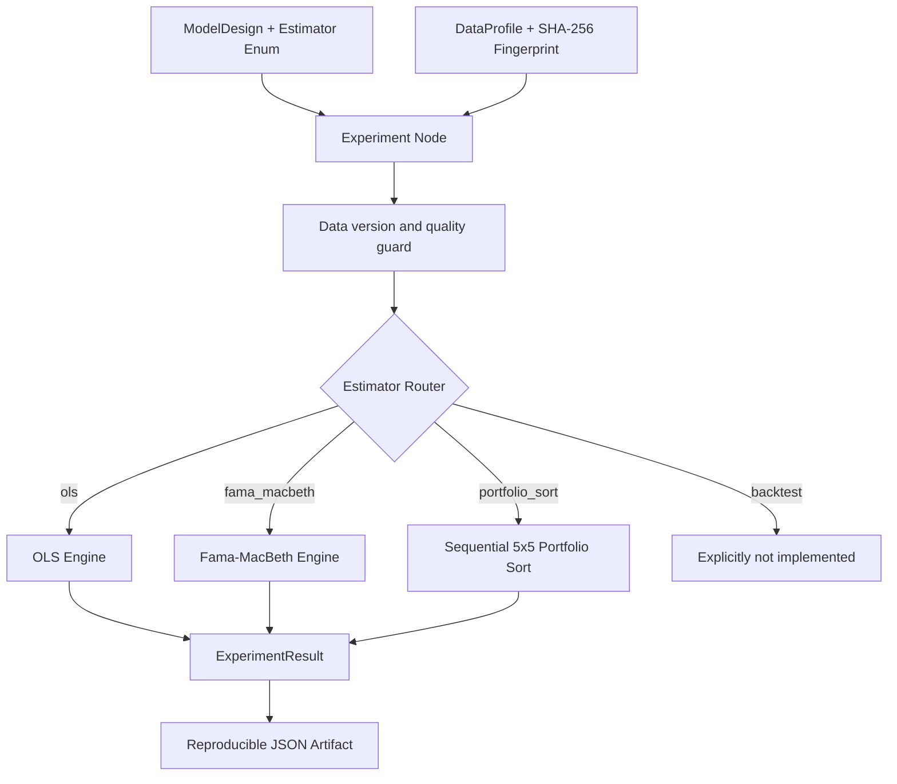

# Experiment Engine

## 数据流

## Estimator 枚举

| 枚举值 | Round 4 状态 | 说明 |
| --- | --- | --- |
| `ols` | 已实现 | 截距、完整样本、HC3/HAC/经典标准误、置信区间和协方差敏感性检查 |
| `fama_macbeth` | 已实现 | 逐期横截面回归、平均斜率、HAC/经典时序推断和无效期间告警 |
| `portfolio_sort` | 已实现 | 月度先按换手率五分组、组内再按 IVOL 五分组，并对 I5-I1 收益使用 HAC 推断 |
| `backtest` | 仅保留路由 | 调用时明确报错，不回退到 OLS |

## 实验前保护

- `look_ahead_bias_checked` 必须为真。
- 实体–日期重复率必须为零。
- DataProfile 必须包含 SHA-256 指纹。
- 执行前重新计算数据文件指纹；文件发生变化时要求重新运行 Data Preparation。
- 模型变量缺失、完整样本为空、参数数大于样本承载能力或设计矩阵不满秩时停止估计。
- Round 4 不悄悄处理 fixed effects；遇到该规格会明确提示尚未实现。

## 输出与复现

ExperimentResult 保存：

- 实际完整样本量与模型指标；
- 系数、标准误、t 值、p 值、置信区间和显著性；
- 稳健性检查及其通过状态；
- 协方差类型、HAC 滞后阶数、有效 Fama–MacBeth 期间数；
- 数据指纹和运行警告。

配置 `artifact_directory` 后，Experiment Node 会使用模型、数据指纹和参数生成稳定 run ID，并保存包含 ModelDesign 与 ExperimentResult 的 JSON 文件。
