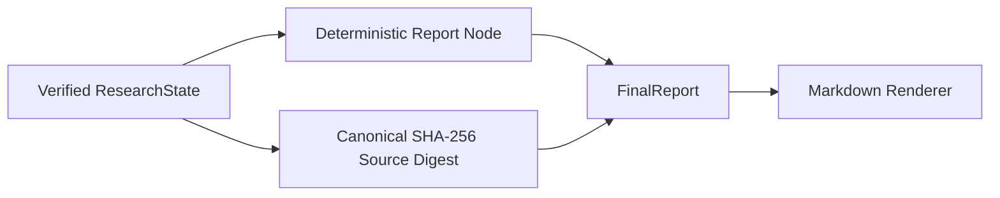

# Traceable Report Generation

## 原则

Report Node 不调用 LLM。最终报告中的论文、假设、模型、数据范围、样本量、系数、标准误、t 值、p 值、置信区间、稳健性与委员会结论全部从已验证的 ResearchState 复制，再由确定性 Markdown 模板渲染。

这避免了报告阶段重新解释或改写统计数字。叙述性 findings 也由 StatisticalResult 自动格式化，不允许另行输入自由数字。

## 输入与输出



FinalReport 同时保存：

- 报告叙述章节；
- ModelDesign 的模型名、公式和 Estimator；
- DataProfile 与 ExperimentResult 的样本量和各自数据指纹；
- 完整 ModelMetrics、StatisticalResult 和 RobustnessCheck；
- 可追溯 PaperReference；
- ReviewDecision 和全部未解决 ReviewIssue；
- 上游状态的稳定 SHA-256 source digest；
- 可选 Markdown artifact 路径。

## Approved 防御性约束

正式 Approved 报告要求：

- 未达到修改次数上限；
- DataProfile 与 ExperimentResult 指纹均存在且一致；
- ModelDesign 与 ExperimentResult 的 Estimator 一致；
- 不存在 blocking ReviewIssue。

任一条件不满足都会阻止生成 Approved 报告。

## 未批准报告

达到修改上限后仍然可以保存审计报告，但必须：

- 显示 `NOT APPROVED — REVISION REQUIRED`；
- 保留所有 blocking issues 和建议；
- 明确写出 committee approval was not obtained；
- 使用“无正式研究结论”的结论文本；
- 不把未通过结果包装为正式发现。

## 复现

```powershell
.\.venv\Scripts\python.exe -m examples.ivol_research_demo
```

命令会运行 7 Node 闭环并生成 `reports/ivol_research_demo.md`。仓库内的 `reports/example_report.md` 是同一确定性模板的检查样例；其中论文、数据和数值均为离线合成 fixture，不是投资证据。
