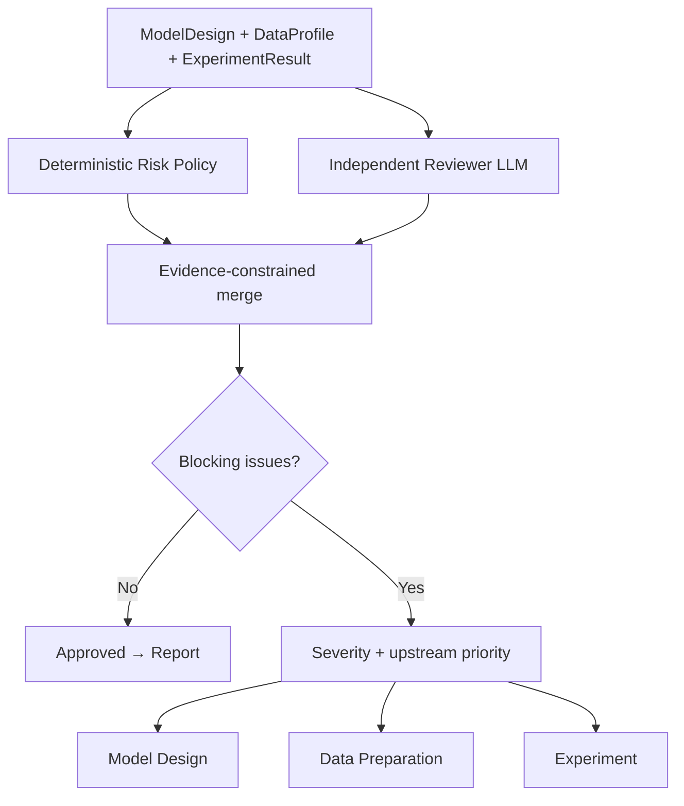

# Research Committee

## 评审结构

## 确定性风险规则

| Rule ID | 检查 | 默认后果 |
| --- | --- | --- |
| `DATA_LOOKAHEAD_001` | 未完成目标日期对齐 | Critical / Data revision |
| `DATA_DUPLICATE_001` | 实体–日期重复键 | High / Data revision |
| `DATA_MISSING_001` | 模型字段缺失率超过阈值 | High / Data revision |
| `DATA_SURVIVORSHIP_001` | 未记录生存者偏差检查 | High / Data revision |
| `EXP_DATA_VERSION_001` | DataProfile 与实验指纹不一致 | Critical / Experiment revision |
| `EXP_CAPACITY_001` | 每参数观察数不足 | High / Experiment revision |
| `EXP_ROBUSTNESS_001` | 缺少稳健性检验 | High / Experiment revision |
| `EXP_ROBUSTNESS_002` | 稳健性检验失败 | High / Experiment revision |
| `MODEL_LIMITATIONS_001` | 未披露模型局限 | High / Model revision |
| `MODEL_ENDOGENEITY_001` | 披露内生性但无处理策略 | High / Model revision |
| `MODEL_SIGN_001` | 显著结果与预期方向相反 | Medium / 非阻断解释事项 |

阈值由 `ReviewPolicyConfig` 管理，可以按照研究用途调整。它们是本项目的内部研究规则，不代表监管合规标准。

## Reviewer 约束

- Reviewer 无法删除 Risk Policy 发现的问题。
- 最终 decision 和 revision target 不采用 LLM 自报值，而是由合并问题重新计算。
- Reviewer 的 High/Critical 问题会阻断，Low/Medium 问题作为非阻断关注事项。
- 每个 Reviewer 问题必须引用 `model_design.*`、`data_profile.*` 或 `experiment_result.*` 的真实顶层字段。
- 无证据、错误来源或不存在字段会使评审输出失败。

## 唯一修改目标

先按严重程度选择问题；相同严重度时优先处理更上游阶段：Model → Data → Experiment。Model 修改会自然重跑 Data 与 Experiment，因此可以减少无效重复工作。

修改次数由顶层 Graph 的 `revision_count` 和 `max_revisions` 控制。达到上限后进入带风险披露的报告路径，不会无限循环，也不代表委员会批准。

## 方法边界

规则设计参考模型风险管理中对开发、验证、数据、假设和治理的关注，但本项目不是合规系统。参考：[Federal Reserve SR 26-2 Revised Guidance on Model Risk Management](https://www.federalreserve.gov/supervisionreg/srletters/SR2602.htm)。
